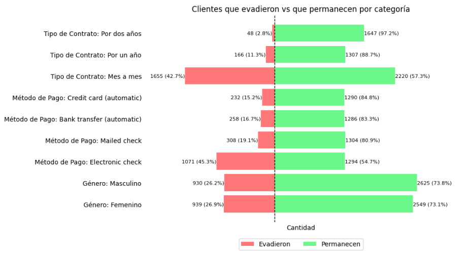
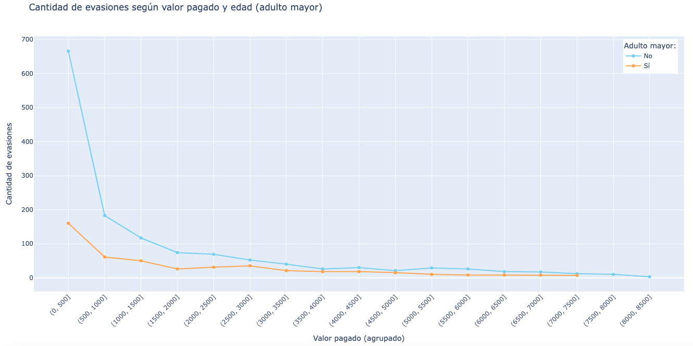
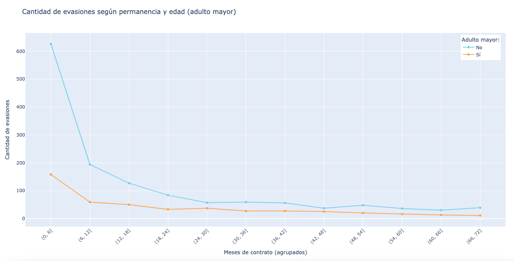

# Challenge ONE - Data Science – Telecom X (parte 1)
## 📊 Análisis de Evasión de Clientes

Este proyecto analiza datos de una empresa de telecomunicaciones para identificar los factores que influyen en la evasión de clientes. Se utilizaron herramientas de ciencia de datos para visualizar, cuantificar y predecir comportamientos de abandono, con el objetivo de proponer estrategias de retención.

---

## 🧠 Objetivo del Proyecto

- Investigar los factores que inciden en la decisión de un cliente de cancelar el servicio.
- Detectar patrones de evasión según edad, método de pago, permanencia y monto pagado.
- Entregar visualizaciones claras y conclusiones accionables para el área de retención.

---

## 📸 Algunas Visualizaciones de Notebook

### Comparación por categorías (género, contrato, método de pago)


---

### Evasión según monto pagado y edad


---

### Evasión según permanencia y edad


---

## 📝 Requerimientos

### Este proyecto requiere Python 3.8+ y las siguientes bibliotecas:

- pandas
- numpy
- matplotlib
- seaborn
- plotly
- notebook (para ejecutar archivos .ipynb localmente) o un entorno virtual

```bash
#### Para revisar las versiones instaladas
import pandas as pd
import numpy as np
import matplotlib
import seaborn as sns
import plotly

print("pandas:", pd.__version__)
print("numpy:", np.__version__)
print("matplotlib:", matplotlib.__version__)
print("seaborn:", sns.__version__)
print("plotly:", plotly.__version__)
```
  
## ¿Como puedes ejecutar un notebook?

- Ejecutarlo localmente en Visual Studio Code
- Cargar el archivo .ipynb a tu Google Disk y ejecutar el notebook en [Google Colab](https://colab.research.google.com)
- Ejecutar en el entorno virtual de GitHub. En tu repositorio, haz clic en el botón verde Code → pestaña Codespaces → selecciona Create codespace on main (o la rama que quieras). 
  
## ⚙️ Instalación y dependencias en el entorno virtual

```bash

# 🧰 ¿Qué necesitas para ejecutar .ipynb localmente?
# ✅ 1. Tener Python instalado
# - Puedes descargarlo desde python.org.
# - Asegúrate de marcar “Add Python to PATH” durante la instalación.

### ✅ 2. Instalar Jupyter Notebook o JupyterLab
# - Lo más cómodo es hacerlo dentro de un entorno virtual:

# Crear entorno virtual (solo la primera vez)
python -m venv venv

# Activar el entorno
# En Windows:
venv\Scripts\activate

# En macOS/Linux:
source venv/bin/activate

# Instalar Jupyter y librerías necesarias
pip install notebook jupyterlab pandas numpy matplotlib seaborn plotly

# ✅ 3. Ejecutar Jupyter Notebook
jupyter notebook
